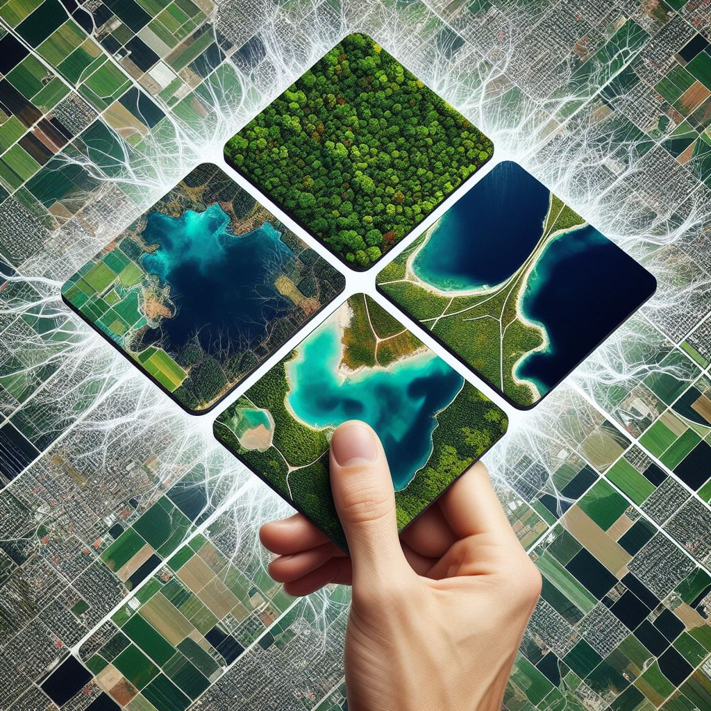
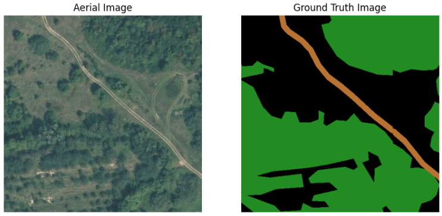
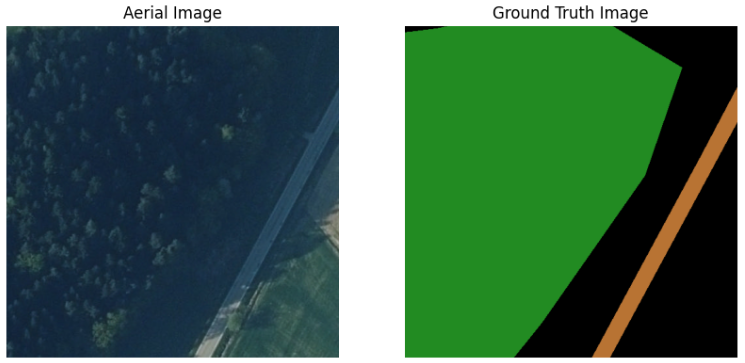
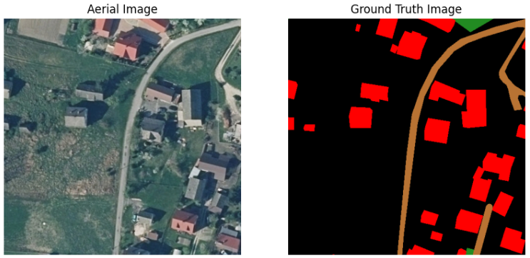
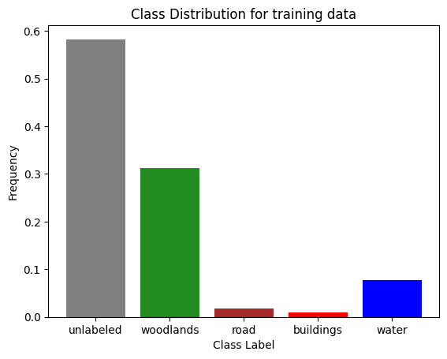
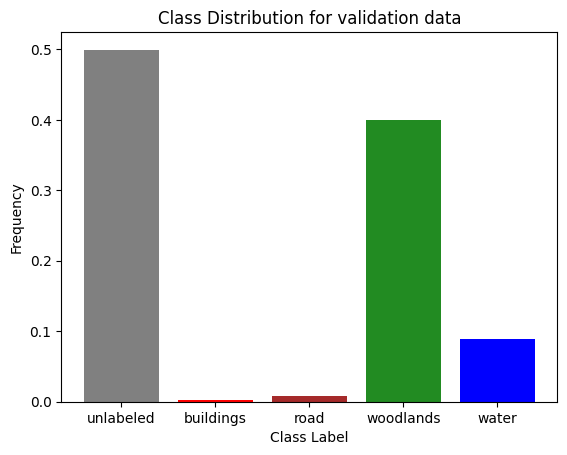
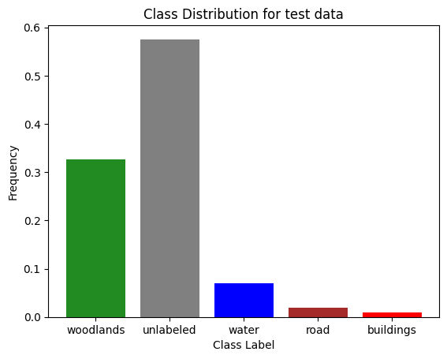
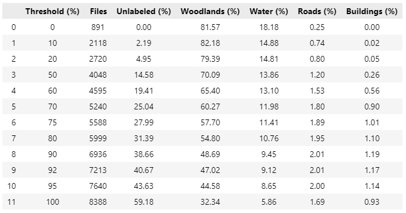

# ML Zoomcamp 2023 Capstone2 Project

 
Image created Microsoft Bing Image Creator (https://www.bing.com/images/create)

## Problem Description
The dataset for this project is from [LandCover.ai](https://landcover.ai.linuxpolska.com/download/landcover.ai.v1.zip). LandCover.ai provides aerial images of Poland (total area of 216.27 km²) and a corresponding mask for each image. That mask labels every pixel of the aerial image with it's own class. The resulting segmentation has 4 landcover classes buildings, woodlands, water and roads. Any pixel that doesn't belong to this classes belong to the fifth class "unlabeled".
The task for this project is to provide an automatic mapping of buildings, woodlands, water and roads from aerial images.

## Data
The raster images are RGB-GeoTiffs with EPSG:2180 spatial reference system and the masks are single-channel GeoTiffs with EPSG:2180 spatial reference system. The dataset contains 33 orthophotos with 25 cm per pixel resolution (~9000x9500 px) and 8 orthophotos with 50 cm per pixel resolution (~4200x4700 px).

To get a better understanding about how the dataset looks like, you find three examples below.

    

    

    

## Reproducibility
It's convenient to track my progress using this README file with the **bold** commands, which provides any command that is needed for every single step. There are some useful shortcuts in the Makefile, for example to create the virtual environment. In case you use my Makefile to create that environment, it will live in the project folder ".venv".
There are many Jupyter notebooks in the Notebook folder which contains everything for:
- Data preparation
- Data analasis
- Training and Tuning of different models
- Selecting and using final model

The most important notebooks are:
- **notebook.ipynb**: That is the collection of any step of my experiment
- **eda.ipynb**: For deeper insight I excluded the biggest part of data analysis to a separate notebook
- **train.ipynb**: Contains each step to train a model / Contains the code for "train.py"

For the peer review you can just follow the steps here in this README file. Everything should work as described in this order.
If you're not a peer reviewer or if you would like to dive deeper, feel free to also explore the other Jupyter notebooks. 

## Preparation & Preprocessing

- Download the dataset (1.43 GB) from https://landcover.ai.linuxpolska.com/download/landcover.ai.v1.zip and unzip.
- Create a new folder "laco.ai" in the project directory. 
- Copy the two folders "images" and "masks" to this folder.
- Use terminal and navigate to the "Utils" folder and use the "prepareInputData.py":

    - **cd Utils**
    - **python prepareInputData.py**

If you use the same folder name as mentioned, you don't need to change anything in this script otherwise you need to change one variable.

**main_folder = './../laco.ai'**

After the run of "prepareInputData.py", you should find a folder (with name specified by "main_folder" variable) with splitted datasets for train, validate, and test with a comparable class distribution. You see the dilemma. The dataset has many unlabeled pixels and is far away from a balanced one as shown below.

    
    
    

There are two different resolutions, and the images are too big to use as they are. This dataset is quite tricky but I had some ideas to come across that challenges.

One idea you can find in the EDA part of this project where I made an analysis to find a better class distribution for the training. My idea was to exclude any image with a high number of unlabeled pixels. The result you can find in the table below.
A threshold of 20% means that any images with more than 20% of unlabeled images are excluded. The number of remaining files you can find in the "Files" column. The other columns show what is the part of each landcover class in the remaining files.

    

For testing you may want to change a few other parameters:
- #Path to the input folders
    - main_folder = './../laco.ai'
- #Tile size for resizing
    - TILE_SIZE = 512
- #Path to the output folders
    - DATA_FOLDER = './../Data'

I manually separated the orthophotos with 25cm pixel resolution ('./../laco.ai_25') from the orthophotos with 50cm pixel resolution './../laco.ai_50', because I made some test runs also on one resolution (for example in train.ipynb) to increase the performance.

## Script train.py
This script starts the final training. The steps are described in the train.ipynb notebook. This script requires the prior run of "prepareInputData.py" as described above. Now you should have a "Data" folder with splitted dataset for train, validate, and test. 

### Recommendation: Training on limited dataset 

#### Recommendation: Step 1
To run a sample training in a reasonable time and with a good result I recommend to run "separateSmallAndBigImages.py" from Utils folder:

- **cd Utils**
- **python separateSmallAndBigImages.py**

Now you can access the data based on the resolution. The folder "laco.ai_big" contains the 8 orthophotos with 50cm resolution and "laco.ai_small" contains 33 orthophotos with 25cm resolution. For the quick run I recommend to go on with the "laco.ai_small" folder.

#### Recommendation: Step 2
Adapt two variables in "prepareInputData.py"...
- main_folder = './../laco.ai_small'
- DATA_FOLDER = './../Data50'

... and run again:

- **cd Utils**
- **python prepareInputData.py**

#### Recommendation: Step 3 - Resample images to 256x256 patches
Ensure that the following default values are set in "prepareTraining.py"
- RESAMPLING = True
- RESAMPLING_IMAGE_SIZE = 256                     # 512, 256, 128
- RESAMPLING_INPUT_FOLDER = './../Data50'
- RESAMPLING_OUTPUT_FOLDER = f"./../Data50_resampled_{RESAMPLING_IMAGE_SIZE}"

- FILTERING = True
- FILTERING_CLASS = 0                             # DEFAULT VALUE = 0 --> This value represents the unlabeled class
- FILTERING_THRESHOLD_FOR_CLASS = 20              # (0..100)

Then run:

- **cd Utils**
- **python prepareTraining.py**

### Run Training
Ensure that the following default values are correctly set in "train.py"
- IMAGE_SIZE = 256                                  # must match to RESAMPLING_IMAGE_SIZE from Step 3
- NUM_CLASSES = 5
- TRAIN_EPOCHS = 50

- TRAIN_SAT_FOLDER = "./../Data50_res256_filtered_20/train/sat/"
- TRAIN_GT_FOLDER = "./../Data50_res256_filtered_20/train/gt/"
- VAL_SAT_FOLDER = "./../Data50_res256_filtered_20/validate/sat/"
- VAL_GT_FOLDER = "./../Data50_res256_filtered_20/validate/gt/"

Then run:

- **cd Scripts**
- **python train.py**

## Script predict.py

## Model serving with TensorFlow Serving

### Step 1: Converting model to saved_model format

### Step 2: Starting model serving component

### Step 3: Starting gateway

### Step 4: Testing

## Serverless Deployment with AWS Lambda

## Troubleshooting
In case there are any problems to create the virtual environment try the following steps:

1. Delete "Pipfile", "Pipfile.lock", and "requirements.txt"
2. Use these commands to build the environment

- **make environment**
- **pipenv install ...**