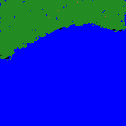
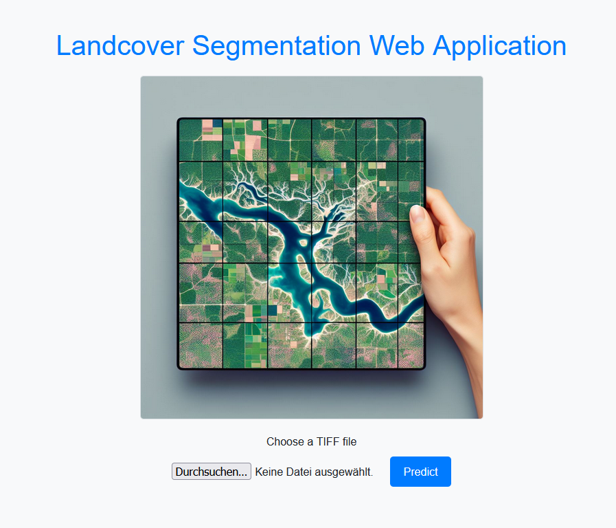
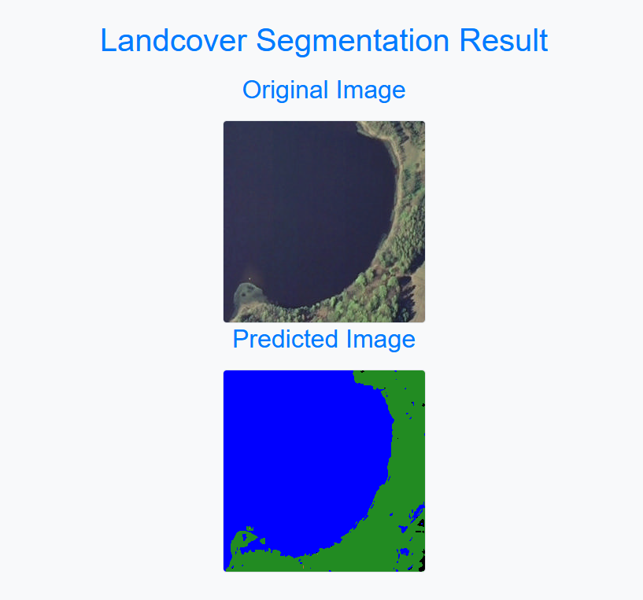

# ML Zoomcamp 2023 Capstone2 Project - Landcover Segmentation

 
Image created Microsoft Bing Image Creator (https://www.bing.com/images/create)

## Problem Description
The dataset for this project is from [LandCover.ai](https://landcover.ai.linuxpolska.com/download/landcover.ai.v1.zip). LandCover.ai provides aerial images of Poland (total area of 216.27 km²) and a corresponding mask for each image. That mask labels every pixel of the aerial image with it's own class. The resulting segmentation has 4 landcover classes: buildings, woodlands, water and roads. Any pixel that doesn't belong to this classes belongs to the fifth class "unlabeled".
The task for this project is to provide an automatic mapping of buildings, woodlands, water and roads from aerial images.

## Data
The raster images are RGB-GeoTiffs with EPSG:2180 spatial reference system and the masks are single-channel GeoTiffs with EPSG:2180 spatial reference system. The dataset contains 33 orthophotos with 25 cm per pixel resolution (~9000x9500 px) and 8 orthophotos with 50 cm per pixel resolution (~4200x4700 px).

**Important note**: If you're using this data, please note the license information on their [web site](https://landcover.ai.linuxpolska.com/). "This dataset is licensed under [Creative Commons Attribution-NonCommercial-ShareAlike 4.0 International License](https://creativecommons.org/licenses/by-nc-sa/4.0/)."

To get a better understanding about how the dataset looks like, you find three examples below.

    

    

    

## Reproducibility
It's convenient to track my progress using this README file with the **bold** commands, which provides any command that is needed for every single step. There are some useful shortcuts in the Makefile, for example to create the virtual environment. In case you use my Makefile to create that environment, it will live in the project folder ".venv".
There are many Jupyter notebooks in the Notebook folder which contains everything for:
- Data preparation
- Data analasis
- Training and Tuning of different models
- Selecting and using final model

The most important notebooks are:
- **notebook.ipynb**: That is the collection of any step of my experiment
- **eda.ipynb**: For deeper insight I excluded the biggest part of data analysis to a separate notebook
- **train.ipynb**: Contains each step to train a model / Contains the code for "train.py"

For the peer review you can just follow the steps here in this README file. Everything should work as described in this order.
If you're not a peer reviewer or if you would like to dive deeper, feel free to also explore the other Jupyter notebooks. 

## Preparation & Preprocessing

- Download the dataset (1.43 GB) from https://landcover.ai.linuxpolska.com/download/landcover.ai.v1.zip and unzip.
- Create a new folder "laco.ai" in the project directory. 
- Copy the two folders "images" and "masks" to this folder.
- Use terminal and navigate to the "Utils" folder and use the "prepareInputData.py":

    - **cd Utils**
    - **python prepareInputData.py**

If you use the same folder name as mentioned, you don't need to change anything in this script otherwise you need to change one variable.

**main_folder = './../laco.ai'**

After the run of "prepareInputData.py", you should find a folder (with name specified by "main_folder" variable) with splitted datasets for train, validate, and test with a comparable class distribution. You see the dilemma. The dataset has many unlabeled pixels and is far away from a balanced one as shown below.

    
    
    

There are two different resolutions, and the images are too big to use as they are. This dataset is quite tricky but I had some ideas to come across that challenges.

One idea you can find in the EDA part of this project where I made an analysis to find a better class distribution for the training. My idea was to exclude any image with a high number of unlabeled pixels. The result you can find in the table below.
A threshold of 20% means that any images with more than 20% of unlabeled images are excluded. The number of remaining files you can find in the "Files" column. The other columns show what is the part of each landcover class in the remaining files.

    

For testing you may want to change a few other parameters:
- #Path to the input folders
    - main_folder = './../laco.ai'
- #Tile size for resizing
    - TILE_SIZE = 512
- #Path to the output folders
    - DATA_FOLDER = './../Data'

## Script train.py
This script starts the final training. The steps are described in the train.ipynb notebook. This script requires the prior run of "prepareInputData.py" as described above. Now you should have a "Data" folder with splitted dataset for train, validate, and test. 

### Recommendation: Training on limited dataset 

#### Recommendation: Step 1
To run a sample training in a reasonable time and with a good result I recommend to run "separateSmallAndBigImages.py" from Utils folder:

- **cd Utils**
- **python separateSmallAndBigImages.py**

Now you can access the data based on the resolution. The folder "laco.ai_big" contains the 8 orthophotos with 50cm resolution and "laco.ai_small" contains 33 orthophotos with 25cm resolution. For the quick run I recommend to go on with the "laco.ai_big" folder.

#### Recommendation: Step 2
Adapt two variables in "prepareInputData.py"...
- main_folder = './../laco.ai_big'
- DATA_FOLDER = './../Data50'

... and run again:

- **cd Utils**
- **python prepareInputData.py**

#### Recommendation: Step 3 - Resample images to 256x256 patches
**Important note**
On my Ubuntu 22.04 pc (32GB RAM) this setting let my machine rebooting, on Windows (32GB RAM) this works fine.
To avoid overloading the machine, you can also choose the safer option and choose a **RESAMPLING_IMAGE_SIZE = 128**. In that case you need to adapt the folder paths (256->128).

Ensure that the following default values are set in "prepareTraining.py"
- RESAMPLING = True
- RESAMPLING_IMAGE_SIZE = 256                     # 512, 256, 128
- RESAMPLING_INPUT_FOLDER = './../Data50'
- RESAMPLING_OUTPUT_FOLDER = f"./../Data50_resampled_{RESAMPLING_IMAGE_SIZE}"

- FILTERING = True
- FILTERING_CLASS = 0                             # DEFAULT VALUE = 0 --> This value represents the unlabeled class
- FILTERING_THRESHOLD_FOR_CLASS = 20              # (0..100)

Then run:

- **cd Utils**
- **python prepareTraining.py**

### Run Training
Ensure that the following default values are correctly set in "train.py"
- IMAGE_SIZE = 256                                  # must match to RESAMPLING_IMAGE_SIZE from Step 3
- NUM_CLASSES = 5
- TRAIN_EPOCHS = 50

- TRAIN_SAT_FOLDER = "./../Data50_res256_filtered_20/train/sat/"
- TRAIN_GT_FOLDER = "./../Data50_res256_filtered_20/train/gt/"
- VAL_SAT_FOLDER = "./../Data50_res256_filtered_20/validate/sat/"
- VAL_GT_FOLDER = "./../Data50_res256_filtered_20/validate/gt/"

Then run:

- **cd Scripts**
- **python train.py**

## Script predict.py
After the training process, you can test your model with the predict.py script. You just need to adapt the *model_path* parameter. 

model_path = "./path/to/your/model/...keras"

Then you can start the Flask application which is a web service that serves your model and waits for your requests. Start the Flask app with these commands:

- **cd Scripts**
- **python predict.py**

You can test your model by providing an image file. Please adapt the *image_path* parameter. The Flask application will return the predicted image mask for the requested aerial image. It is automatically saved to the Scripts folder with the name "predicted_image.png". Run these commands:

- **cd Scripts**
- **python predict-test.py**

One sample image looks like:

    

## Flask Web Application
There is a second Flask application, that provide a nicer visualization. You can find it in the FlaskWebApp folder. The configuration is very easy, because it's the same as you already did in the predict.py file. You only need to change the *model_path* parameter.

model_path = "./path/to/your/model/...keras"

Then you can start the Flask application with these commands:

- **cd FlaskWebApp**
- **python predictWithWebsite.py**

Then open a web browser and open that link http://localhost:9898/ and you can use another way to check your model.

    

Choose an aerial image and upload it. Wait a moment and you'll see both files your uploaded image and the prediction for that image.

    

## Serverless Deployment with AWS Lambda
In this section I describe how I use AWS Lambda for the serverless deployment of my model. You can find all the preparation in the Jupyter notebook called "notebook_serverless.ipynb" in the Notebook folder. Ensure that you have a converted model file "final-model.tflite" in your Deployment folder. Here ("notebook_serverless.ipynb") you can find the steps to convert a model. If you want to see this in action you just need the following commands:

- **cd Deployment**
- **docker build -t segmentation-model .**
- **docker run -it --rm -p 8080:8080 segmentation-model:latest**

Now you have a docker container running with the image public.ecr.aws/lambda/python:3.10. That container is waiting to answer requests for given aerial images. To send a request you can run the "test.py" script. Ensure that the "image_path" is correctly set.

- **cd Deployment**
- **python test.py**

## Troubleshooting
In case there are any problems to create the virtual environment try the following steps:

1. Delete "Pipfile" and "Pipfile.lock"
2. Use these commands to build the environment

- **make environment**
- **pipenv shell**
- **pip install -r requirements.txt**          # for Ubuntu
- **pip install -r requirements_Windows.txt**  # for Windows